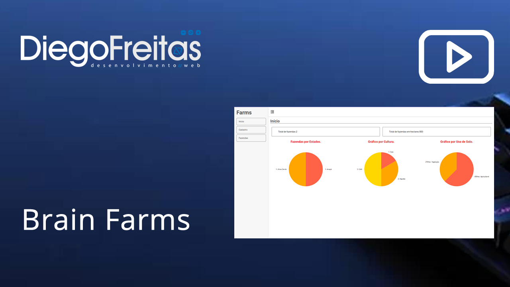
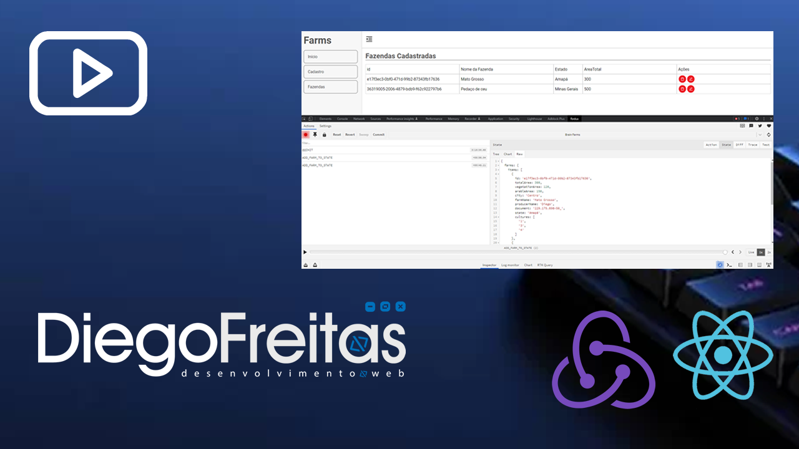

# Sobre

Esta aplicação foi desenvolvida para atender um teste tecnico solitado pela empresa NTT Data, foi constituido com [React](https://pt-br.reactjs.org) com typescript

## Rodar local
 Execute os comandos abaixo:

```
git clone git@github.com:diegozfreitas/nttdata-teste.git nttdata-teste
cd nttdata-teste
npm install ou yarn
npm run start ou yarn start
```

## Link online desse projeto em funcionamento

Para ver este projeto online [clique aqui](https://nttdata-teste-one.vercel.app/)

## Prints do projeto


# Video sobre o projeto

    Em breve...
<!-- <a href="https://youtu.be/kQbjFAIpf3Q" target="_blank">
    
</a> -->

# Video técnico sobre o projeto

    Em breve...
<!-- <a href="https://youtu.be/T1THr3vIv0w" target="_blank">
    
</a> -->

